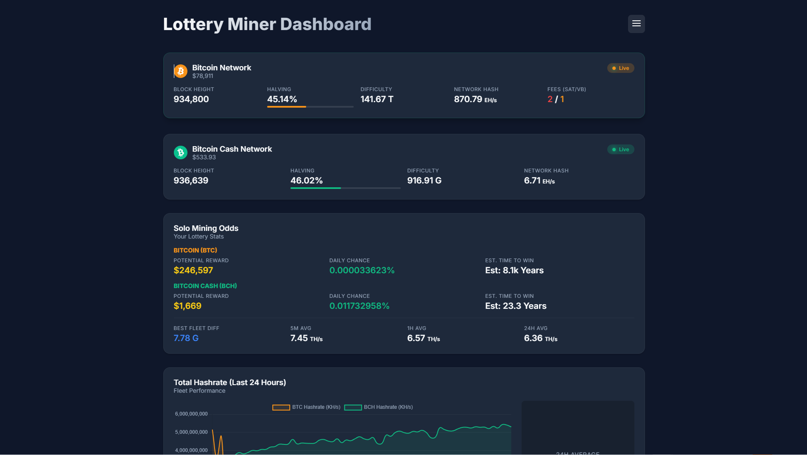
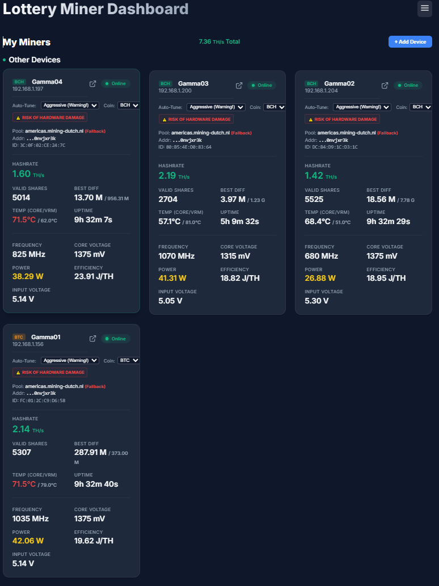
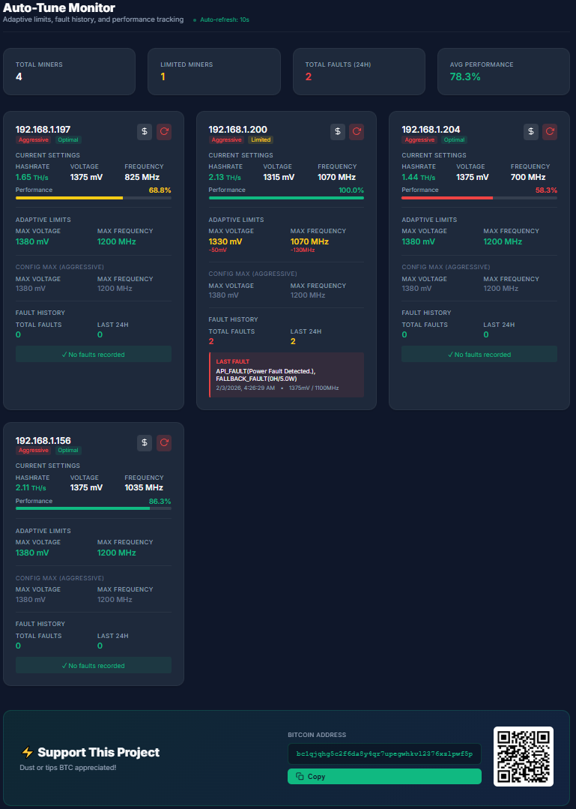
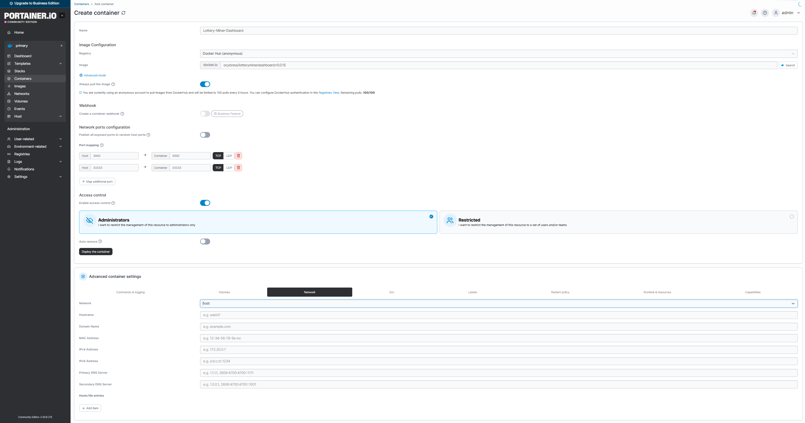

# Lottery Miner Dashboard With an AATE (Adaptive Auto-Tuning Engine)
**Disclaimer**
This software is a work in progress, although I do all of my own testing on my own hardware i will not be held responsible for any damage to you or your hardware as a result of using this software.

**Hardware Compatibility**
This dashboard is designed to work with both Bitaxe and NerdMiner hardware, however the Auto-Tuning Engine is only compatible with Bitaxe hardware. and only tested on Bitaxe Gamma 601 devices running firmware version 2.12.0. I will add support for other Bitaxe devices such as multi Asic units either by having someone else test it for me who has the hardware or by purchasing one myself, or hardware donations are welcome if feasible. If you would like to assist in testing new hardware please contact get in contact with me at OCybress+dashboardtesting@gmail.com

## Devices tested with AATE
| Device | Asic | Voltage | Firmware | Confirmed Working |
|---|---|---|---|---|
| Bitaxe Gamma 601 | 1 x BM1370 | 5V | 2.12.0 | Yes |
| NerdQAxe++ rev5.1 (with Mods) | 4 x BM1370 | 12V | 2.12.0 | Testing |
| NerdQAxe++ rev5.1 | 4 x BM1370 | 12V | 2.12.0 | Testers needed |
| NerdQAxe++ rev6+ | 4 x BM1370 | 12V | 2.12.0 | Testers needed |
| BitAxe GT 800 | 2 x BM1370 | 12V | 2.12.0 | Testing - Testers needed |

**About**
This is a local dashboard to monitor and configure your LotteryMiner fleet via UDP and REST API. It supports Bitcoin (BTC) and Bitcoin Cash (BCH) mining stats and serves as a central hub for real-time monitoring and autonomous optimization.



> [!IMPORTANT]
> **NerdMiner Users**: To use auto-discovery and remote configuration, you must flash the [LotteryMiner Custom Firmware](https://github.com/WeisTekEng/NerdMiner_v2). This firmware broadcasts the required JSON payload via UDP.
>
> **Bitaxe Users**: No special firmware is required! Official Bitaxe firmware works out-of-the-box with this dashboard.

## Key Features

*   **Auto-Tune Engine**: [Bitaxe hardware only] Autonomous frequency and voltage optimization with adaptive per-unit learning.
    *   **Conservative Mode**: Safe adjustments to optimize stability and efficiency.
    *   **Aggressive Mode**: Maximizes performance (requires caution/improved cooling).
    *   **Cost Sensitive Mode (NEW)**: Optimizes hashrate while strictly adhering to a daily budget ($/day).
    *   **Adaptive Limits**: Automatically learns each unit's hardware capabilities and respects individual limitations.
    *   **Smart Tuning**:
        *   **PLL Voltage Curves**: Uses voltage curves + safety margins for precise tuning, BM1370 has a 
        full voltage curve available, BM1387 does not needs more testing and community feedback.
        *   **Dual-Stage Optimization**: First maximizes frequency ("The Climb"), then minimizes voltage ("The Squeeze").
        *   **Adaptive Step Sizing**: Takes large frequency steps (e.g., +40MHz) when far from limits, and precision steps (e.g., +10MHz) when close.
    *   **Full Documentation**: See [AATE Deep Dive](documentation/AATE_Documentation.md).
*   **Live Server Logs**: Real-time streaming of server-side adjustments and status updates directly on the dashboard.
*   **Multi-Coin Support**: Track Bitcoin (BTC) and Bitcoin Cash (BCH) network stats simultaneously.
*   **Solo Mining Odds**: Integrated "Lottery" stats calculation for both BTC and BCH, including potential rewards and daily win probability.
*   **Auto-Discovery**: Miners appear automatically via UDP broadcast (port 33333).
*   **Remote Configuration**: [Nerdminers Only] Change Pool, Port, Address, and Password via a secure backend proxy.
*   **Modular UI**: Responsive, modern interface with detailed historical hashrate charts.

---
## Remote Configuration (Nerdminers only)

To configure a miner remotely:
1.  Ensure you are running the **latest firmware** with the REST API enabled.
2.  On the dashboard, click the **Gear Icon** on the miner card.
3.  A modal will appear showing the current settings.
4.  Update your Pool, Wallet, etc., and click **Save Changes**.
5.  The miner will save settings to NVS and restart automatically.

## Live Server Logs

The dashboard includes a "Live Logs" page for real-time monitoring:
-   **Auto-Tune Adjustments**: See exactly when the engine increases or throttles a miner, including PLL-based voltage decisions.
-   **Adaptive Limit Learning**: Watch as units learn their individual capabilities.
-   **Fault Detection**: Real-time visibility into fault confirmation and recovery.
-   **Cost Tracking**: Monitor real-time daily cost vs budget (in Cost Sensitive Mode).
-   **Discovery Events**: Track when new devices are found on your network.
-   **Network Status**: Real-time feedback on API communication and stats fetching.

## Installation and use

### (Option 1) Non-Docker Setup run straight from the repo on your computer.
1.  **Clone this repos master branch**
    ```bash
    git clone https://github.com/WeisTekEng/LotteryDashboard.git
    ```
1.  **Install Dependencies**:
    ```bash
    npm install
    ```
2.  **Start the Server**:
    ```bash
    node server.js
    ```
3.  **Access Dashboard**:
    Open your browser and navigate to `http://localhost:3000`.

### Docker & Umbrel Support

#### (Option 2) running the docker image
There are a few ways to run this using docker, if your on windows use docker desktop
1.  Install docker desktop from https://www.docker.com/products/docker-desktop/ or do a google search for docker desktop
    if you don't trust links.
2. once docker desktop is installed you can run the docker localy by running this command.
    ```bash
    docker build -t aateminerdashboard .
    ```
3.  **Run the image**
    this will run the image in the background and bind the ports to your host machine.
    ```bash
    docker run -d -p 3000:3000 -p 33333:33333/udp --name aateminerdashboard aateminerdashboard
    ```
    *Uses port mapping. Access at http://localhost:3000*

#### (Option 3) Pull the image from dockerhub using the command line
1.  **Pull the image**
    ```bash
    docker pull ocybress/aateminerdashboard:latest
    ```
2.  **Run the image without persistence**
    ```bash
    docker run -d -p 3000:3000 -p 33333:33333/udp --name aateminerdashboard ocybress/aateminerdashboard:latest
    ```
3.  **Run the image with persistence**
    Be sure to replace `/path/to/data` with the path to a directory you want to use for persistence.
    ```bash
    docker run -d -p 3000:3000 -p 33333:33333/udp --name aateminerdashboard -v /path/to/data:/app/data ocybress/aateminerdashboard:latest
    ```
4.  **Access Dashboard**
    Open your browser and navigate to `http://localhost:3000`.

#### (Option 4) Pull the image from dockerhub using docker desktop
1.  Open docker desktop
2.  Navigate to the Docker Hub tab
3.  Search for `aateminerdashboard`
4.  Click on the pull button    
5.  Wait for the image to pull
6.  Navigate to the Images tab
7.  Click on the run button
8.  a `Run a new container` window will appear
9.  Click on the Optional settings dropdown
10. Name the container.
11. Add the host ports `3000:3000` TCP and `33333:33333` UDP
12. ** for persistence ** click the three dots in the host path and select the data directory.
13. Enter `/app/data` in the container path.
14. Click the deploy button.
15. Wait for the container to start.
16. Navigate to `http://localhost:3000` to access the dashboard.
17. Once the page has loaded, go to the dashboard settings page, under Dashboard Network set SCAN_SUBNET to the subnet of your local network, this will allow the dashboard to scan for miners on your network.

**Note:** [Nerdminers] UDP broadcasts from miners may not reach the container on Windows due to Docker's networking limitations. For full functionality, deploy on Linux/Umbrel.

### (Option 5) Umbrel
This app is ready for Umbrel, Although not available yet on the umbrel app store, you can use portainer to install and run it.
**Using portainer**

#### Method 1 (Recommended)
1.  Install Portainer from the Umbrel app store
2.  Once in Portainer, navigate to the environment usualy named **primary** you want to run this container in, 
3.  click on **connect** 
4.  then on the left side panel you will see Containers, go to this tab and click on "Add Container" on the far right.
5.  For docker.io images, you can pull my latest image from dockerhub `ocybress/aateminerdashboard:latest` or visit the repo on dockerhub at https://hub.docker.com/r/ocybress/aateminerdashboard to see the tags and pull the feature banches or dev branch.
6.  For the ports, add `3000:3000` TCP, and `33333:33333` UDP
7.  Click "deploy the container"
8.  Wait for the container to start
9.  Navigate to `http://localhost:3000` to access the dashboard
10. Once the page has loaded, go to the dashboard settings page, under Dashboard Network set SCAN_SUBNET to the subnet of your local network, this will allow the dashboard to scan for miners on your network.



### Persistent Configuration (Editing Settings)
I have not been successful in getting persistance to work with Portainer in umbrel.

### Exposing the dashboard via Tailscale
You can expose the dashboard via [Tailscale](https://tailscale.com/) if you want to access it from other devices or from outside your home network, the UI is built to work with both desktop and mobile devices. you can find the quickstart guide for setting up tailscale [here](https://tailscale.com/quickstart/).

### Advanced Configuration (config.json)

You can override any setting in the dashboard (ports, scan intervals, auto-tune profiles) by either creating a `config.json` file in your mapped `data` folder. or navigating to the Settings page and editing the settings there.

**Example `config.json`:**
```json
{
  "PORTS": {
    "HTTP": 8080
  },
  "LIMITS": {
    "SCAN_INTERVAL": 300000
  },
  "AUTOTUNE": {
    "conservative": {
      "tempTarget": 63,
      "maxErrorRate": 0.03,
      "freqStep": 15
    },
    "aggressive": {
      "maxVoltage": 1450,
      "maxFreq": 1300,
      "tempTarget": 72
    }
  }
}
```
*Note: You only need to include the settings you want to change. Others will keep their default values.*

### Auto-Tune Engine Best Practices

#### Auto-Tune Engine Deployment

1. **Start Fresh for Major Updates**
   ```bash
   # Delete existing autotune state to let units re-learn
   rm data/autotune_state.json
   ```
   For best results set each miner to a baseline freq / core voltage,
   such as 600 / 1150

2. **Monitor Learning Phase** (first 24-48 hours)
   - Units will test their limits
   - Some may fault a few times while learning
   - This is expected and normal
   - After learning, faults should be rare

3. **Use Conservative Mode Initially**
   - Verify stability before switching to aggressive
   - Ensure cooling is adequate
   - Monitor temperatures closely

4. **Upgrade Cooling for Aggressive Mode**
   - Add or upgrade fans
   - Ensure proper airflow
   - Consider heatsink upgrades
   - Monitor VRM temperatures

#### Maintenance
**Fault reviews and limit management are integrated into the Auto-Tune Monitor page.**

1. **Review Fault History**
   - Click the **$ (Dollar/Cache)** icon on any miner card in the Auto-Tune Monitor.
   - This displays the **Adaptive Limits** modal, showing the current learned max voltage/frequency and the last 10 faults.
   - **What to look for**:
     - **Same fault repeatedly**: Hardware issue (needs repair).
     - **Faults during high ambient temp**: Cooling insufficient.
     - **Random scattered faults**: Normal learning process.

2. **Reset Limits**
   - If you change hardware (new PSU, new fan), you should reset the learned limits.
   - Click the **Reset (Cycle)** icon on the miner card.
   - Confirm the action to clear `autotune_state.json` for that specific miner.

3. **Manual Limits**
   - Advanced users can manually set limits via the API (see `documentation/AATE_Documentation.md`) or by editing `data/autotune_state.json` manually (requires restart).
#### Troubleshooting

**Unit Won't Reach Expected Frequency**
1. Check if **Adaptive Limits** are lower than config: Click the **$** icon in Auto-Tune Monitor.
2. Review fault history in the modal to identify root cause (e.g. repeated Power Faults).
3. Fix hardware issue if present (PSU, cooling, etc.)
4. Reset adaptive limits: Click the **Reset** icon on the miner card.

**Limits Too Conservative**
1. Review last fault in history
2. If it was transient (power spike, thermal spike), manually increase limits
3. Try small increments: +20mV, +30MHz at a time
4. Monitor for 1 hour before further increases

**Constant Faults Despite Adaptive Limits**
1. Likely hardware failure (PSU, bad cap, thermal paste)
2. Check power supply voltage under load
3. Verify adequate cooling
4. Consider unit needs repair/replacement

**Limits Not Being Learned**
1. Verify unit is actually faulting (look for "CRITICAL FAULT CONFIRMED")
2. Check fault counter reaching 3
3. If unit is stable, it won't learn (no faults = no learning)
4. This is normal for high-quality units

### Testing Recommendations

1. **Baseline Test** (before enabling AutoTune)
   - Run all units at fixed, conservative settings
   - Record baseline hashrate, temperature, power
   - Verify all units are healthy

2. **AutoTune Deployment**
   - Enable conservative mode for all units
   - Monitor for 24 hours
   - Check for frequency increases and stable operation

3. **Performance Verification**
   - Compare to baseline
   - Verify 10-20% hashrate improvement (typical)
   - Confirm stable error rates (< 1%)
   - Check temperatures within targets

4. **Fault Response Test**
   - Intentionally trigger fault (disconnect power briefly)
   - Verify fault detection, learning, and recovery
   - Confirm adaptive limits set correctly

5. **Long-Term Monitoring**
   - Track for 7 days minimum
   - Watch for oscillation between settings
   - Ensure temperature margins maintained
   - Verify adaptive limits are reasonable

---

The AATE deep dive documentation can be found here: [AATE Deep Dive](documentation/AATE_Documentation.md)

---

## Tips / Donations

Found this useful? Tips are never required but appreciated!

**BTC:** `bc1qjqhg5c2f6da8y4qr7upegwhkvl2376xzlpwf5p`
**ETH:** `0x1c054d43c8b6452ceb5d9fe773cc7da66764c283`
**SOL:** `GTMphvuZU3QsHbieCwWutf1gRGmLWWEVY5dPq73pkgnz`
**USDC on Ethereum:** `0x1c054d43c8b6452ceb5d9fe773cc7da66764c283`

---

## Quick Reference

### Temperature Targets by Mode
| Mode | Target | Warning | Danger | Emergency |
|------|--------|---------|--------|-----------|
| Conservative | 62°C | 67°C | 72°C | 75°C |
| Aggressive | 71°C | 72°C | 73°C | 75°C |

### Voltage/Frequency Ranges
| Mode | Voltage Range | Frequency Range | Step Sizes |
|------|---------------|-----------------|------------|
| Conservative | 1150-1250mV | 450-575MHz | 10mV / 10MHz |
| Aggressive | 1150-1380mV | 675-1200MHz | 2.8mV / 6.25MHz |

### Adjustment Intervals
| Mode | Interval | Cooldown After Throttle |
|------|----------|------------------------|
| Conservative | 60s | 5 cycles (5 min) |
| Aggressive | 30s | 5 cycles (2.5 min) |

### Safety Margins (Adaptive Limits)
- Voltage: 2× voltageStep (20-30mV below fault point)
- Frequency: 3× freqStep (30MHz below fault point)
- Confirmation: 3 consecutive fault cycles required

---
