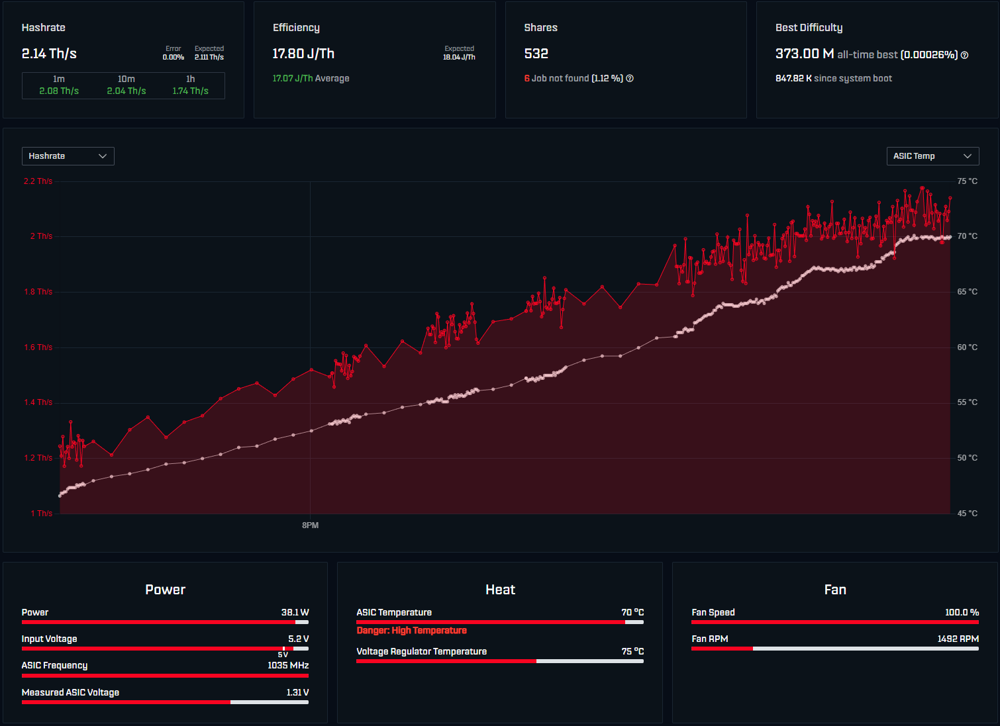
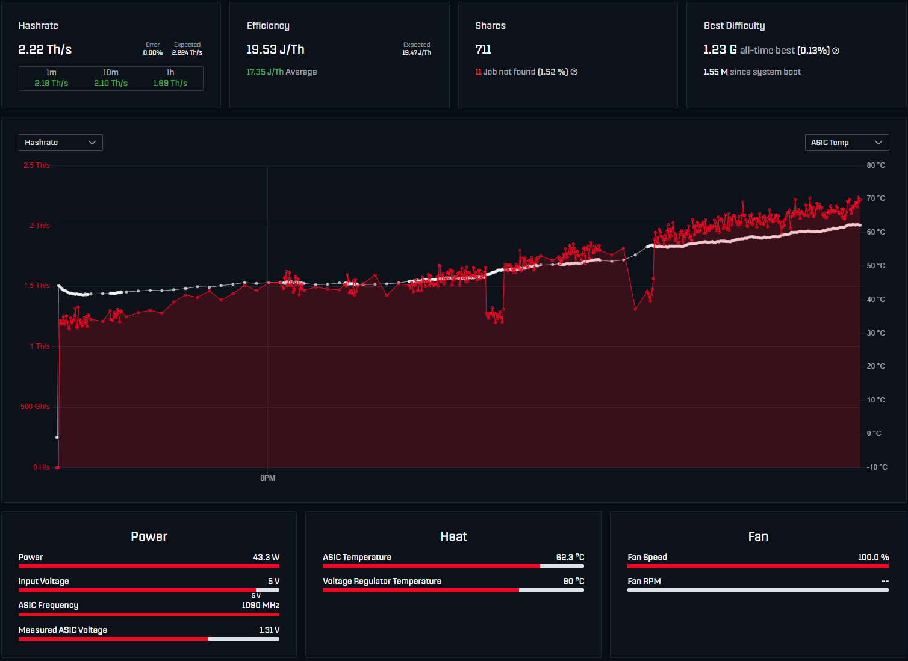
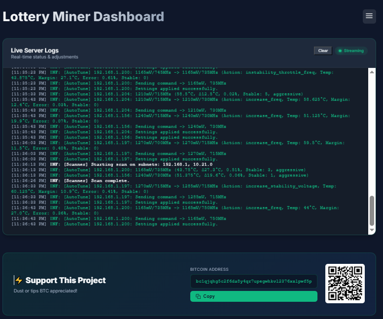
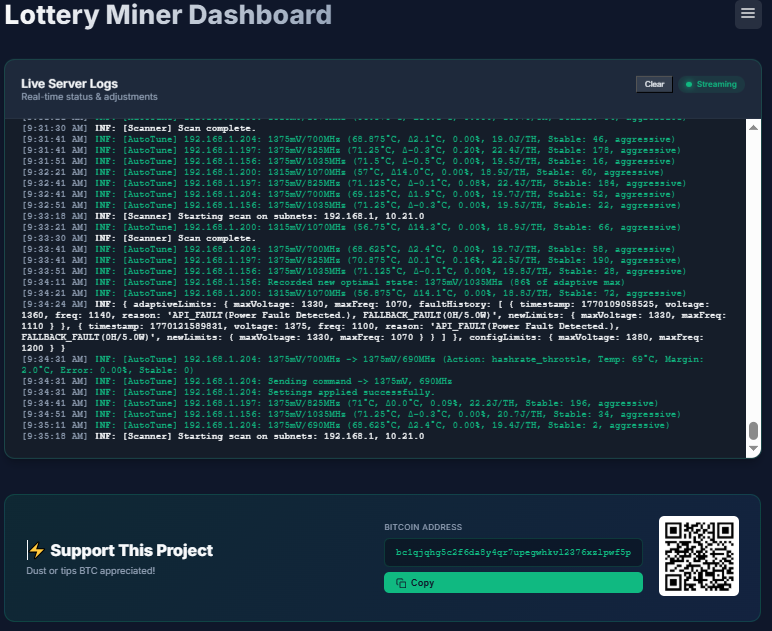
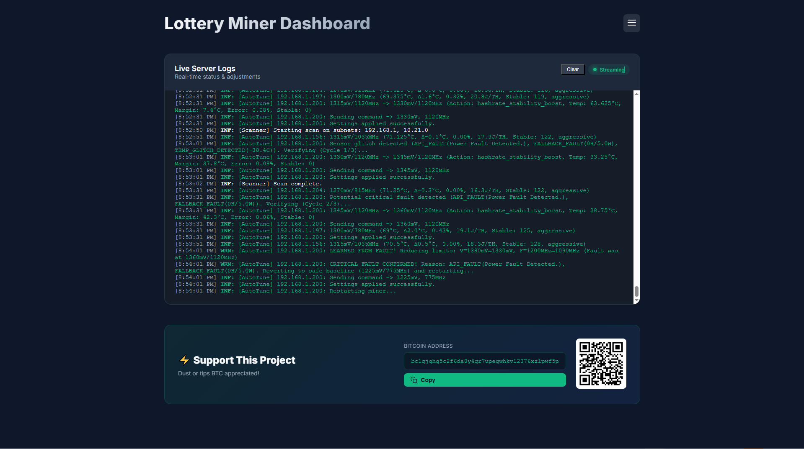

# LotteryMiner Dashboard With AATE (Adaptive Auto-Tune Engine)
This software is a work in progress, although I do all of my own testing on my own hardware i will not be held responsible for any damage to your or your hardware as a result of using this software.

This is a local dashboard to monitor and configure your LotteryMiner fleet via UDP and REST API. It supports Bitcoin (BTC) and Bitcoin Cash (BCH) mining stats and serves as a central hub for real-time monitoring and autonomous optimization.


> [!IMPORTANT]
> **NerdMiner Users**: To use auto-discovery and remote configuration, you must flash the [LotteryMiner Custom Firmware](https://github.com/WeisTekEng/NerdMiner_v2). This firmware broadcasts the required JSON payload via UDP.
>
> **Bitaxe Users**: No special firmware is required! Official Bitaxe firmware works out-of-the-box with this dashboard.

## Key Features

*   **Auto-Tune Engine**: [Bitaxe hardware only] Autonomous frequency and voltage optimization with adaptive per-unit learning.
    *   **Conservative Mode**: Safe adjustments to optimize stability and efficiency.
    *   **Aggressive Mode**: Maximizes performance (requires caution/improved cooling).
    *   **Adaptive Limits**: Automatically learns each unit's hardware capabilities and respects individual limitations.
*   **Live Server Logs**: Real-time streaming of server-side adjustments and status updates directly on the dashboard.
*   **Multi-Coin Support**: Track Bitcoin (BTC) and Bitcoin Cash (BCH) network stats simultaneously.
*   **Solo Mining Odds**: Integrated "Lottery" stats calculation for both BTC and BCH, including potential rewards and daily win probability.
*   **Auto-Discovery**: Miners appear automatically via UDP broadcast (port 33333).
*   **Remote Configuration**: [Nerdminers Only] Change Pool, Port, Address, and Password via a secure backend proxy.
*   **Modular UI**: Responsive, modern interface with detailed historical hashrate charts.

---

## Auto-Tune Engine Deep Dive

The Auto-Tune engine is an autonomous feedback system designed to find the optimal operating point for each individual ASIC chip. Since no two chips are identical due to manufacturing variance, the engine continuously monitors telemetry and makes intelligent micro-adjustments to maximize hashrate while maintaining stability and thermal safety.

**Bitaxe 601 - Gamma01 - Hashrate Increasing**

**Bitaxe 601 - Gamma02 - Hashrate Increasing**


### Core Architecture

The engine operates on a **10-30 second feedback loop** with a **frequency-first optimization philosophy**. This engine prioritizes frequency adjustments and uses voltage surgically, preventing a "voltage creep" problem where units end up at maximum voltage with low frequency.

### How It Works

#### 1. Telemetry Collection (Every 10-30s)
The engine fetches comprehensive real-time data from each miner:
- **Core Temperature**: Primary thermal metric
- **VRM Temperature**: Power delivery health
- **Input Voltage**: 5V rail monitoring (critical for fault detection)
- **Power Consumption**: Actual watts drawn
- **Hash Performance**: Actual vs expected hashrate
- **Error Rates**: Hardware errors and rejected shares
- **Share Statistics**: Valid/invalid share tracking

#### 2. Intelligent Analysis

**Stability Monitoring**
- Calculates a 5-cycle **moving average error rate** for stability
- Tracks hardware error deltas to detect sudden instability
- Monitors hashrate performance (actual vs expected)
- Distinguishes between minor variance and critical issues

**Thermal Management**
- Uses **5-cycle temperature moving average** to filter sensor noise
- Tracks temperature margins (target temp - actual temp)
- Detects impossible temperature drops (sensor glitches)
- Prevents over-reaction to transient thermal spikes

**Efficiency Analysis** (Conservative Mode)
- Calculates Joules per Terahash (J/TH)
- Compares against target efficiency
- Optimizes for cost-effectiveness, not just raw speed

**Adaptive Learning**
- Records critical faults with voltage/frequency context
- Sets per-unit maximum limits with safety margins
- Maintains fault history (last 10 faults)
- Respects learned limits in all future optimization decisions

#### 3. Priority-Based Decision Making

The engine uses a strict priority system to handle multiple conditions:

| Priority | Condition | Frequency Action | Voltage Action | Rationale |
|----------|-----------|-----------------|----------------|-----------|
| **1** | Critical Fault | Safe baseline (min + 100MHz) | Safe baseline (min + 50mV) | Guaranteed safe recovery + learns adaptive limits |
| **2** | Emergency (≥75°C) | Set to minimum | Set to minimum | Maximum cooling |
| **3** | Soft Fault (VRM/Power) | -2× freqStep | Only if freq at min | Immediate throttle, frequency first |
| **4** | Temp Danger (≥72°C) | -2× freqStep | -1× voltStep if needed | Aggressive cooling |
| **5** | Temp Warning (≥68°C) | -1× freqStep | -1× voltStep only if freq at min | Gradual cooling |
| **6a** | High Instability | -1× freqStep (if freq > min+buffer) | +1× voltStep only if freq low | Prefer freq reduction |
| **6b** | Low Hash Performance | 0 | +1× voltStep (small bump) | Try voltage first for hash issues |
| **7** | Optimal Temp + Freq Headroom | +1-1.5× freqStep (scaled by margin) | -1× voltStep if very stable | **Main optimization path** |
| **8** | Low Efficiency | -1× freqStep | -1× voltStep only if freq at min | Efficiency tuning |
| **9** | High Efficiency Headroom | +1× freqStep | 0 | Performance increase |
| **10** | At Max V + Very Stable | 0 | -1× voltStep | Voltage pullback optimization |

#### 4. Adjustment Actions

**Frequency Scaling**
- Increases in 10-15MHz steps when conditions are optimal
- Scales increase rate based on temperature margin (1.5× faster if margin > 5°C)
- Reduces by 10MHz (warning) or 20MHz (danger) for thermal issues
- Always checks against **adaptive limits** before increasing

**Voltage Balancing**
- Small voltage bumps (+10mV) only when frequency reduction isn't viable
- Voltage reduction attempts during voltage pullback optimization
- Respects per-frequency voltage caps
- Never exceeds learned adaptive limits

**Stability Management**
- Tracks consecutive stable cycles
- Requires 5-30 stable cycles before allowing aggressive increases
- Resets stability counter on any adjustment
- Records "Last Known Good" state only at ≥80% of adaptive max frequency

### Adaptive Per-Unit Limits

**The Problem**: Hardware variance means some units can't reach the same limits as others. A unit with a marginal 5V power rail might fault at 1380mV/1200MHz, even though that's within spec for most units.

**The Solution**: Automatic per-unit limit learning.

#### How Adaptive Limits Work

1. **Fault Detection & Confirmation**
   - System detects critical fault (API fault, power fault, voltage out of range)
   - Waits for 3 consecutive fault cycles (30s) to confirm not transient
   - Records the exact voltage and frequency at which fault occurred

2. **Limit Calculation with Safety Margins**
   ```javascript
   // Example: Unit faults at 1380mV / 1200MHz
   Safety margins:
   - Voltage: 2 × voltageStep = 20-30mV
   - Frequency: 3 × freqStep = 30MHz
   
   New adaptive limits:
   - maxVoltage: 1380mV - 20mV = 1360mV
   - maxFreq: 1200MHz - 30MHz = 1170MHz
   ```

3. **Persistent Learning**
   - Limits saved to `autotune_state.json`
   - Survives restarts and redeployments
   - Maintains fault history with timestamps and reasons

4. **Enforcement**
   - All optimization decisions respect adaptive limits
   - Unit will never attempt to exceed learned safe values
   - "Last Known Good" tracking considers adaptive limits
   - Optimal state defined as ≥80% of adaptive max frequency

#### Example Log Output
**Auto-Tune Logs**

**Auto-Tune stabalizing**

**Auto-Tune Power fault detected, new hardware limits learned**


#### Use Cases for Adaptive Limits

**Case 1: Weak 5V Power Rail**
- **Problem**: Unit has 5V rail that sags under load, causing power faults at 1380mV/1200MHz
- **Solution**: AutoTune learns limits are 1360mV/1170MHz, operates stably at 99% of other units' performance
- **Result**: No constant faults, near-maximum hashrate maintained

**Case 2: Poor Cooling Environment**
- **Problem**: Unit in hot location can't reach maximum frequency without overheating
- **Solution**: Repeated thermal faults teach the system this unit's thermal ceiling
- **Result**: Unit optimizes to its environment, can be moved and limits reset later

**Case 3: Mixed Hardware Quality**
- **Problem**: Fleet of 10 units, 8 excellent, 2 marginal
- **Solution**: 8 units reach config max, 2 learn their own slightly lower limits
- **Result**: Zero manual intervention, each unit optimized individually

**Case 4: Silicon Lottery Winners**
- **Problem**: One unit has exceptional silicon, could run higher than config max
- **Solution**: Manually set higher adaptive limits for that unit only
- **Result**: Best chips pushed harder, average chips run at normal limits

### Operation Modes

#### Conservative Mode
**Target Profile**: 24/7 uptime, efficiency-focused, minimal user intervention

**Parameters**:
- Voltage Range: 1150mV - 1250mV
- Frequency Range: 450MHz - 575MHz
- Temperature Target: 62°C
- Temperature Warning: 67°C
- Temperature Danger: 72°C
- Target Efficiency: 16 J/TH
- Max Error Rate: 5%
- Adjustment Interval: 60 seconds

**Characteristics**:
- Lower thermal stress
- Longer hardware lifespan
- Reduced power consumption
- Automatic efficiency optimization
- Safe for passive cooling
- Ideal for enclosed spaces

#### Aggressive Mode
**Target Profile**: Maximum hashrate, enthusiast-grade, active cooling required

**Parameters**:
- Voltage Range: 1150mV - 1380mV
- Frequency Range: 675MHz - 1200MHz
- Temperature Target: 71°C
- Temperature Warning: 72°C
- Temperature Danger: 73°C
- Target Efficiency: None (prioritizes speed)
- Max Error Rate: 0.25% configurable in config.json
- Adjustment Interval: 30 seconds

**Characteristics**:
- Maximum hashrate potential
- Higher power consumption
- Increased heat generation
- **Requires upgraded cooling** (larger heatsink or active fan)
- Faster adjustment responses
- Not recommended for stock cooling

> [!WARNING]
> **Aggressive Mode Cooling Requirements**: Heat generation increases exponentially with voltage. Running aggressive mode on stock cooling will trigger constant thermal throttling. Upgrade to a larger heatsink or add/upgrade fans before enabling aggressive mode. The AutoTune engine will attempt to learn the unit's thermal limits and adjust accordingly, but it cannot overcome fundamental cooling limitations, it also does not control onboard fans at this time.

### Safety & Self-Healing Mechanisms

#### Emergency Cooling
**Trigger**: Core temperature ≥ 75°C
**Action**: Immediate drop to minimum voltage and frequency
**Recovery**: Gradual ramp-up after temperature normalizes
**Purpose**: Prevent thermal damage to ASICs

#### Critical Fault Recovery
**Triggers**:
- API reports power fault
- Zero hashrate with power consumption > 10W
- Input voltage out of range (< 4.8V or > 5.6V)
- Impossible temperature drops (sensor glitch)

**Confirmation**: Requires 3 consecutive fault cycles (30s)

**Actions**:
1. Learn adaptive limits from fault (voltage - 20mV, frequency - 30MHz)
2. Log fault to history with timestamp and reason
3. Revert to safe baseline (min + 50mV, min + 100MHz)
4. Restart miner
5. Lock out adjustments for 120 seconds (stabilization period)

**Recovery**:
- Gradual ramp from safe baseline
- Respects newly learned adaptive limits
- Never exceeds previously faulted settings

#### Soft Fault Handling (VRM/Power Limits)
**Triggers**:
- VRM temperature ≥ 85°C (conservative) or 86°C (aggressive)
- Power consumption exceeds configured limit

**Action**: Immediate throttle (frequency -20MHz, voltage -10mV only if freq at min)
**No Restart**: Handles gracefully without full restart
**Purpose**: Prevent escalation to critical fault

#### Stabilization Periods
**When Applied**:
- After restart: 120 seconds
- After any adjustment: Until next adjustment interval
- During fault confirmation: 30 seconds (3 cycles)

**Purpose**: 
- Prevent "chasing" transient spikes
- Allow hardware to settle
- Ensure measurements are accurate
- Avoid oscillation between settings

#### Temperature Glitch Detection
**Detection**: Core temp drops > 25°C to below 40°C in one cycle
**Likely Cause**: Sensor failure, firmware glitch, loose thermistor
**Action**: Log warning, continue monitoring, do not react to impossible reading
**Purpose**: Prevent inappropriate throttling due to sensor errors

### Key Algorithm Improvements

The current engine represents significant improvements over traditional auto-tuning approaches:

#### 1. Frequency-First Philosophy
**Old Approach**: "If unstable, add voltage until stable, then try frequency"
- Result: Voltage creep, frequency stagnation, units stuck at max voltage/low frequency

**New Approach**: "Always prefer frequency adjustments, use voltage surgically"
- Result: High frequency operation, voltage only as needed
- Key Insight: Frequency affects power/heat/stability; voltage mainly affects stability
- Therefore: Use frequency as primary lever, voltage as fine-tuning

#### 2. Nuanced Stability Response
**Before**:
- Instability → Add voltage (+10mV)
- Still unstable → Add more voltage (+10mV)
- Repeat until voltage maxes out
- Only then reduce frequency

**Now**:
- High instability → Reduce frequency first (if headroom exists)
- Only add voltage if frequency already low
- Different severities get different responses
- No one-way voltage ratchet effect

#### 3. Relaxed Frequency Increase Logic
**Before**:
- Required 10 stable cycles after ANY throttling
- Temperature warnings constantly reset counter
- Frequency rarely increased

**Now**:
- Reduced cooldown to 5 cycles after throttling, 2 cycles normally
- Temperature margin consideration (won't increase if margin < 3°C)
- Scaled increase rate (1.5× faster if margin > 5°C)
- Simultaneous freq increase + voltage decrease when very stable

#### 4. Smart Fault Recovery
**Before**:
- Reverted to "last known good" state
- But that state might have caused the problem
- Created fault loops

**Now**:
- Always revert to guaranteed-safe baseline
- Learn from fault and set adaptive limits
- Gradual climb from known-safe state
- Never attempt failed settings again

#### 5. Better "Last Known Good" Tracking
**Before**:
- Recorded any stable state after 20 cycles
- Included low-frequency states as "good"

**Now**:
- Only records truly optimal states (30 cycles, < 1% error, ≥80% of adaptive max freq)
- Ensures "good" state is actually high-performance
- Considers adaptive limits, not just config limits

### Configuration Recommendations

#### For Better Frequency Retention

```json
{
  "AUTOTUNE": {
    "conservative": {
      "tempTarget": 63,
      "tempWarning": 68,
      "tempDanger": 72,
      "maxErrorRate": 0.03,
      "freqStep": 15,
      "voltageStep": 10
    },
    "aggressive": {
      "tempTarget": 72,
      "tempWarning": 73,
      "tempDanger": 74,
      "maxErrorRate": 0.20,
      "freqStep": 15,
      "voltageStep": 10
    }
  }
}
```

**Changes Explained**:
- **tempTarget**: Slightly higher to provide more thermal headroom for freq increases
- **maxErrorRate**: Slightly stricter to prevent instability before it becomes critical
- **freqStep**: Larger steps for faster recovery after throttling

#### Safety Margin Tuning

Edit in code if needed:
```javascript
// In fault handling section
const safetyMarginV = config.voltageStep * 2; // Default: 20-30mV
const safetyMarginF = config.freqStep * 3;    // Default: 30MHz
```

**More Conservative** (larger margins):
- Reduces risk of repeated faults
- May leave some performance on the table
- Better for production/critical environments

**More Aggressive** (smaller margins):
- Pushes closer to true hardware limits
- May cause occasional faults while finding exact limit
- Better for testing/optimization phases

### Monitoring & Diagnostics

#### Understanding Log Output

**New Enhanced Format**:
```
[AutoTune] 192.168.1.100: 1200mV/575MHz -> 1200mV/590MHz 
  (Action: increase_freq, Temp: 60°C, Margin: 3.0°C, 
   Error: 0.45%, Stable: 12)
```

**Key Metrics**:
- **Margin**: Temperature headroom (target - actual). Aim for 3-8°C
- **Error**: Smoothed error rate over last 5 cycles
- **Stable**: Consecutive stable cycles (higher = more confident in settings)

**Heartbeat Logs** (every ~1 minute when stable):
```
[AutoTune] 192.168.1.100: 1200mV/575MHz (60°C, Δ3.0°C, 0.45%, 15.2J/TH, Stable: 45, conservative)
```

Shows current state including efficiency (if in conservative mode).

#### Good Signs ✅
- `increase_freq` actions happening regularly
- `increase_freq_reduce_voltage` (simultaneous optimization!)
- Stable count increasing (10, 20, 30+)
- Temperature margin steady at 3-8°C
- Error rate consistently < 1%
- Voltage NOT at maximum for extended periods

#### Warning Signs ⚠️
- Frequent `increase_stability_voltage` (stability issues)
- `instability_throttle_freq` repeating (hardware or cooling problem)
- Stable count never exceeding 10 (constant adjustments)
- Temperature margin < 1°C (too aggressive for cooling)
- Multiple fault cycles for same unit
- Adaptive limits significantly below config limits

#### Bad Signs ❌
- Voltage at maximum for > 1 hour
- Frequency stuck at minimum
- Constant fault → restart → fault loop
- Temperature margin negative (exceeding target)
- Error rate > 5% sustained
- Multiple units learning adaptive limits (systemic issue)

#### API Endpoints for Adaptive Limits

```javascript
// Get adaptive limits for specific miner
GET /api/autotune/:ip/adaptive-limits
Response: {
  "ip": "192.168.1.197",
  "adaptive": { "maxVoltage": 1360, "maxFreq": 1170, "faultHistory": [...] },
  "config": { "maxVoltage": 1380, "maxFreq": 1200 },
  "reduction": { "voltage": 20, "frequency": 30 },
  "isLimited": true
}

// Reset adaptive limits to config defaults
POST /api/autotune/:ip/adaptive-limits/reset

// Manually set adaptive limits
PUT /api/autotune/:ip/adaptive-limits
Body: { "maxVoltage": 1350, "maxFreq": 1150 }

// Get summary of all miners
GET /api/autotune/adaptive-limits/summary
Response: {
  "totalMiners": 4,
  "limitedMiners": 1,
  "miners": [...]
}
```

### Best Practices

#### Deployment

1. **Start Fresh for Major Updates**
   ```bash
   # Delete existing autotune state to let units re-learn
   rm data/autotune_state.json
   ```
   For best results set each miner to a baseline freq / core voltage,
   such as 600 / 1150

2. **Monitor Learning Phase** (first 24-48 hours)
   - Units will test their limits
   - Some may fault a few times while learning
   - This is expected and normal
   - After learning, faults should be rare

3. **Use Conservative Mode Initially**
   - Verify stability before switching to aggressive
   - Ensure cooling is adequate
   - Monitor temperatures closely

4. **Upgrade Cooling for Aggressive Mode**
   - Add or upgrade fans
   - Ensure proper airflow
   - Consider heatsink upgrades
   - Monitor VRM temperatures

#### Maintenance

1. **Review Fault History Weekly**
   ```javascript
   const limits = autoTuneEngine.getAdaptiveLimits('192.168.1.197');
   console.log(limits.adaptiveLimits.faultHistory);
   ```
   
   If you see:
   - **Same fault repeatedly**: Hardware issue, needs repair
   - **Faults during high ambient temp**: Cooling insufficient
   - **Random scattered faults**: Normal learning, no action needed

2. **Reset Limits After Hardware Changes**
   ```javascript
   // After PSU replacement, cooling upgrade, etc.
   autoTuneEngine.resetAdaptiveLimits('192.168.1.197');
   ```

3. **Set Manual Limits for Known Issues**
   ```javascript
   // If you know a unit has a weak 5V rail at 4.85V
   autoTuneEngine.setAdaptiveLimits('192.168.1.197', 1300, 1100);
   ```

#### Troubleshooting

**Unit Won't Reach Expected Frequency**
1. Check if adaptive limits lower than config: `getAdaptiveLimits(ip)`
2. Review fault history to identify root cause
3. Fix hardware issue if present (PSU, cooling, etc.)
4. Reset adaptive limits: `resetAdaptiveLimits(ip)`

**Limits Too Conservative**
1. Review last fault in history
2. If it was transient (power spike, thermal spike), manually increase limits
3. Try small increments: +20mV, +30MHz at a time
4. Monitor for 1 hour before further increases

**Constant Faults Despite Adaptive Limits**
1. Likely hardware failure (PSU, bad cap, thermal paste)
2. Check power supply voltage under load
3. Verify adequate cooling
4. Consider unit needs repair/replacement

**Limits Not Being Learned**
1. Verify unit is actually faulting (look for "CRITICAL FAULT CONFIRMED")
2. Check fault counter reaching 3
3. If unit is stable, it won't learn (no faults = no learning)
4. This is normal for high-quality units

### Testing Recommendations

1. **Baseline Test** (before enabling AutoTune)
   - Run all units at fixed, conservative settings
   - Record baseline hashrate, temperature, power
   - Verify all units are healthy

2. **AutoTune Deployment**
   - Enable conservative mode for all units
   - Monitor for 24 hours
   - Check for frequency increases and stable operation

3. **Performance Verification**
   - Compare to baseline
   - Verify 10-20% hashrate improvement (typical)
   - Confirm stable error rates (< 1%)
   - Check temperatures within targets

4. **Fault Response Test**
   - Intentionally trigger fault (disconnect power briefly)
   - Verify fault detection, learning, and recovery
   - Confirm adaptive limits set correctly

5. **Long-Term Monitoring**
   - Track for 7 days minimum
   - Watch for oscillation between settings
   - Ensure temperature margins maintained
   - Verify adaptive limits are reasonable

---

## Remote Configuration

To configure a miner remotely:
1.  Ensure you are running the **latest firmware** with the REST API enabled.
2.  On the dashboard, click the **Gear Icon** on the miner card.
3.  A modal will appear showing the current settings.
4.  Update your Pool, Wallet, etc., and click **Save Changes**.
5.  The miner will save settings to NVS and restart automatically.

## Live Server Logs

The dashboard includes a "Live Logs" page for real-time monitoring:
-   **Auto-Tune Adjustments**: See exactly when the engine increases or throttles a miner
-   **Adaptive Limit Learning**: Watch as units learn their individual capabilities
-   **Fault Detection**: Real-time visibility into fault confirmation and recovery
-   **Discovery Events**: Track when new devices are found on your network
-   **Network Status**: Real-time feedback on API communication and stats fetching

## Installation

### Non-Docker Setup
1.  **Install Dependencies**:
    ```bash
    npm install
    ```
2.  **Start the Server**:
    ```bash
    node server.js
    ```
3.  **Access Dashboard**:
    Open your browser and navigate to `http://localhost:3000`.

### Docker & Umbrel Support

#### Linux / Umbrel (Recommended)
```bash
docker compose up -d --build
```
*Uses `network_mode: "host"` for proper UDP broadcast reception.*

#### Windows (Testing/Development)
```bash
docker compose -f docker-compose.windows.yml up -d --build
```
*Uses port mapping. Access at http://localhost:3000*

**Note:** UDP broadcasts from miners may not reach the container on Windows due to Docker's networking limitations. For full functionality, deploy on Linux/Umbrel.

### Umbrel
This app is ready for Umbrel.
1.  Install Portainer from the Umbrel app store
2.  Once in Portainer, navigate to the environment you want to add this to, then click on "Add Container"
3.  For docker.io image, use `ocybress/nerdminer-dashboard-linux:r0.0.8`
4.  For the ports, add `3000` TCP, and `33333` UDP
5.  Click "deploy the container"
6.  Wait for the container to start
7.  Navigate to `http://localhost:3000` to access the dashboard
8.  You can expose this via Tailscale if you want to access it from other devices

### Persistent Configuration (Editing Settings)

To ensure your settings are saved when the container restarts and to allow manual editing of configuration files:
1.  In Portainer, during container creation (or under "Duplicate/Edit"), go to the **Volumes** tab.
2.  Click **+ map additional volume**.
3.  **Container path**: `/app/data`
4.  **Host path** (or Volume): 
    - Select **Bind** (important for easy file access).
    - Enter a path for your data on the host, for example: `/home/umbrel/lottery-data`.
5.  This allows you to edit settings directly from your host filesystem. Settings will persist exactly in that folder even if the container is deleted.

### Advanced Configuration (config.json)

You can override any setting in the dashboard (ports, scan intervals, auto-tune profiles) by creating a `config.json` file in your mapped `data` folder.

**Example `config.json`:**
```json
{
  "PORTS": {
    "HTTP": 8080
  },
  "LIMITS": {
    "SCAN_INTERVAL": 300000
  },
  "AUTOTUNE": {
    "conservative": {
      "tempTarget": 63,
      "maxErrorRate": 0.03,
      "freqStep": 15
    },
    "aggressive": {
      "maxVoltage": 1450,
      "maxFreq": 1300,
      "tempTarget": 72
    }
  }
}
```
*Note: You only need to include the settings you want to change. Others will keep their default values.*

---

## Tips / Donations

Found this useful? Tips are never required but appreciated!

**BTC:** `bc1qjqhg5c2f6da8y4qr7upegwhkvl2376xzlpwf5p`
**ETH:** `0x1c054d43c8b6452ceb5d9fe773cc7da66764c283`
**SOL:** `GTMphvuZU3QsHbieCwWutf1gRGmLWWEVY5dPq73pkgnz`
**USDC on Ethereum:** `0x1c054d43c8b6452ceb5d9fe773cc7da66764c283`

---

## Quick Reference

### Temperature Targets by Mode
| Mode | Target | Warning | Danger | Emergency |
|------|--------|---------|--------|-----------|
| Conservative | 62°C | 67°C | 72°C | 75°C |
| Aggressive | 71°C | 72°C | 73°C | 75°C |

### Voltage/Frequency Ranges
| Mode | Voltage Range | Frequency Range | Step Sizes |
|------|---------------|-----------------|------------|
| Conservative | 1150-1250mV | 450-575MHz | 10mV / 10-15MHz |
| Aggressive | 1150-1380mV | 675-1200MHz | 10-15mV / 10-15MHz |

### Adjustment Intervals
| Mode | Interval | Cooldown After Throttle |
|------|----------|------------------------|
| Conservative | 60s | 5 cycles (5 min) |
| Aggressive | 30s | 5 cycles (2.5 min) |

### Safety Margins (Adaptive Limits)
- Voltage: 2× voltageStep (20-30mV below fault point)
- Frequency: 3× freqStep (30MHz below fault point)
- Confirmation: 3 consecutive fault cycles required

---
